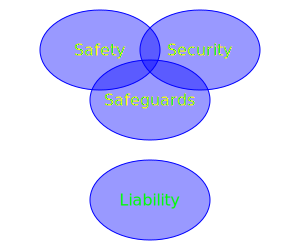

# concept

## refs
+ Luis Lederman, "Legislative and regulatory framework for the for the safe implementation of a Nuclear Power Programme", Regulatory Control Training Workshop, Regulatory Cooperation Forum, Morocco, 6-10 Nov 2017, p 9, url <https://slideplayer.com/slide/14690066/> [20221018].