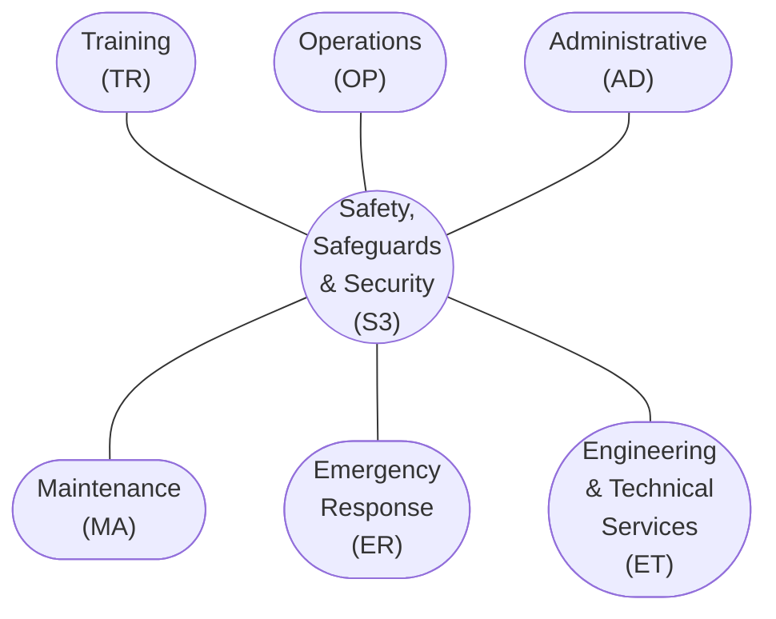

# integration

$
{\rm S3} = f_0({\rm TR}, {\rm OP}, {\rm AD}, {\rm MA}, {\rm ER}, {\rm ET})
$

$
{\rm TR} = f_1(\ , \ , \ , \ , \ )
$

$
{\rm OP} = f_2(\ , \ , \ , \ , \ )
$

$
{\rm AD} = f_3(\ , \ , \ , \ , \ )
$

$
{\rm MA} = f_4(\ , \ , \ , \ , \ )
$

$
{\rm ER} = f_5(\ , \ , \ , \ , \ )
$

$
{\rm ET} = f_6(\ , \ , \ , \ , \ )
$